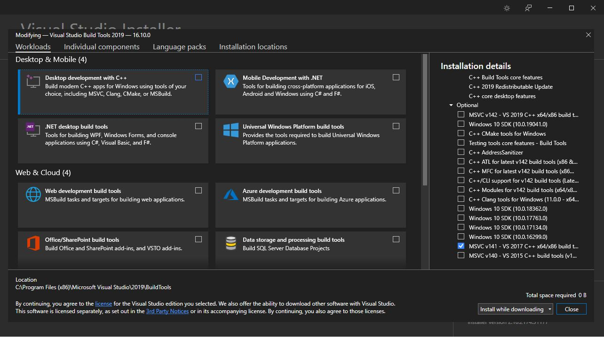
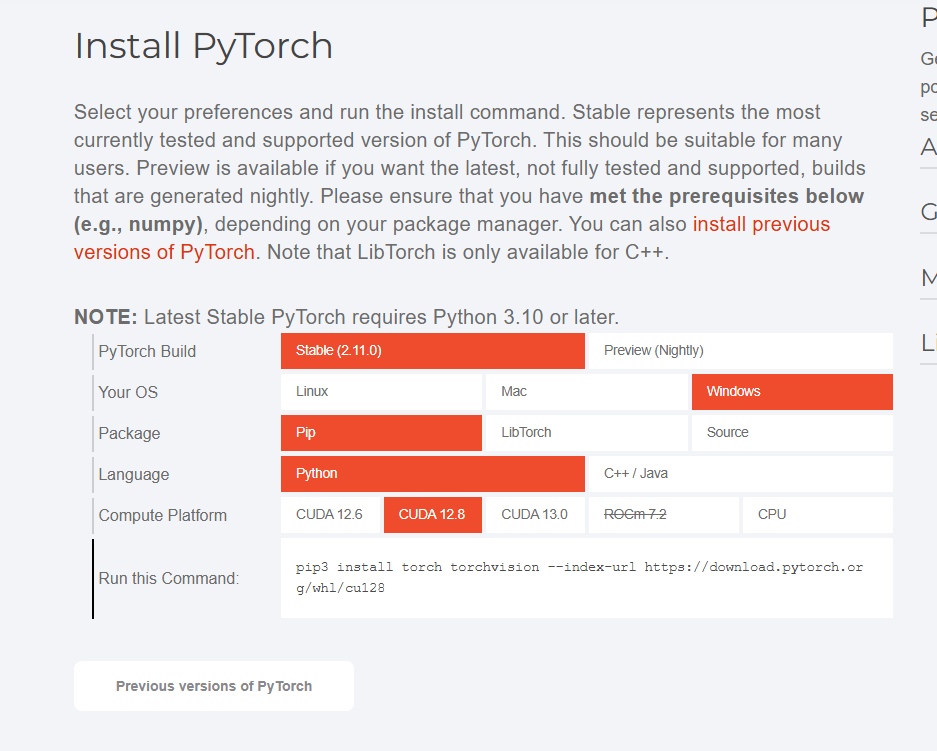
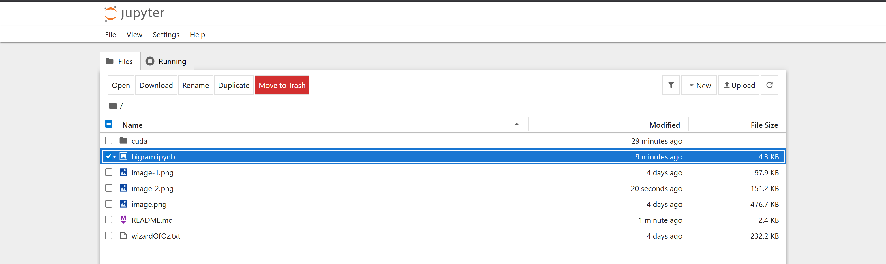
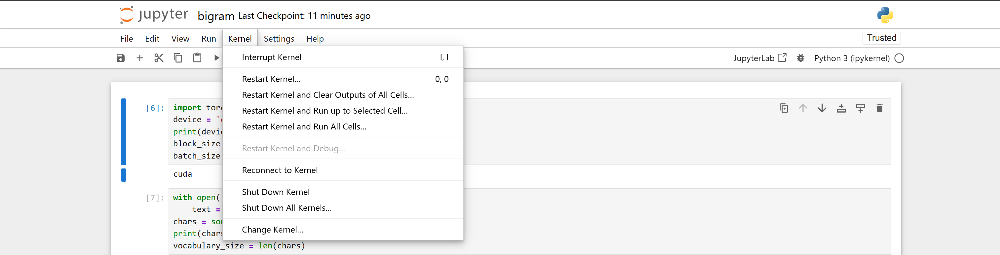
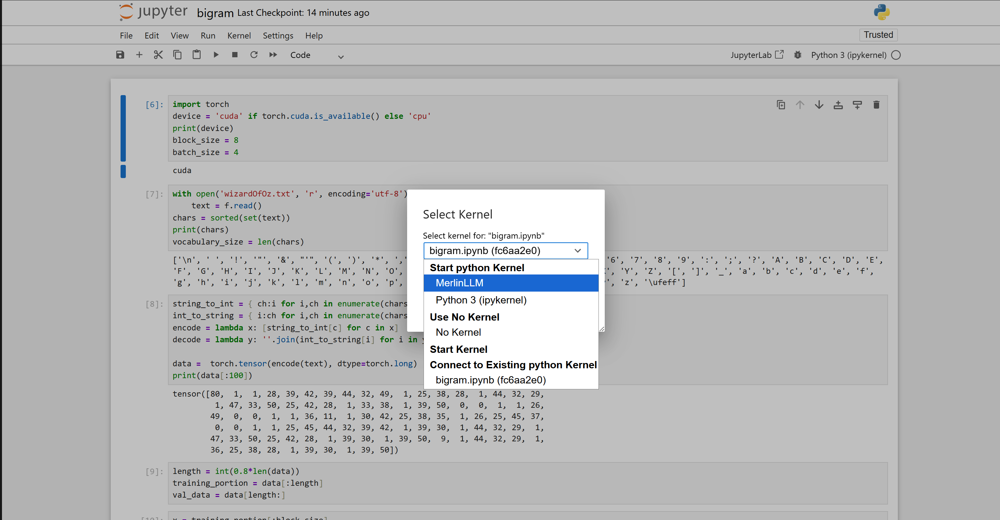

# Installing Dependencies

## Before installing dependencies

Make sure you have Microsoft Visual C++ 14.0 or greater installed
To install it, go to this link

```
https://visualstudio.microsoft.com/visual-cpp-build-tools/
```

During install, select `Desktop Development with C++`, and then proceed to install


After install make sure to restart windows.

## Setup/Dependencies

You will first need to setup the virtual environment using cuda
The terminal command (on Windows) is:

```
python -m venv cuda
```

And then you will install your dependencies onto the virtual environment
Use the following command to enter the virtual environment, when you are installing your dependencies or doing any other work afterwards:

```
cuda\Scripts\activate
```

You will need to install the following dependencies

1. matplotlib
2. numpy
3. pylzma
4. ipykernel
5. jupyter
6. torch

You can download all of the dependencies using this terminal command (on Windows):

```
pip3 install matplotlib numpy pylzma ipykernel jupyter
```

if you have errors with installing the dependencies, and the error tells you to update pip3 
go ahead and use the command given by the error message to update pip3 in the virtual environment
(Do not forget to go into the virtual environment first, using the command given above, before you do the update)

To install torch you can go to this link

```
https://pytorch.org/
```

Scroll down until you see this:



And choose your preferences and use the link given to you at the bottom
For reference, the image contains my preferences and the command I used

```
pip3 install torch torchvision --index-url https://download.pytorch.org/whl/cu128
```

## Things/Commands to Know

Remember all commands and work is to be done in the python virtual environment
Refer to [README line 30](README.md#L30) to find the command to use the virtual environment that was setup

Once all the dependencies have been installed, you can open the jupyter notebook
using this command:

```
jupyter notebook
```

You need to make sure you're running the jupyter code in cuda so we create a kernel
and on the jupyter notebook you change the kernel to whatever the display name you set
For reference, this is the command I used to initialize my cuda kernel:

```
python -m ipykernel install --user --name=cuda --display-name "MerlinLLM"
```

Then to change the kernel you are working on, in the bigram file
When you run the command on [README line 78](README.md#L78), you will be directed to this page 



Then double click on the bigram.ipynb file and it will take you here
Then select the `Kernel` tab and select `Change Kernel`



You will get a screen like this:



Just go ahead and choose the kernel that corresponds to the display name you created (Mine is MerlinLLM)